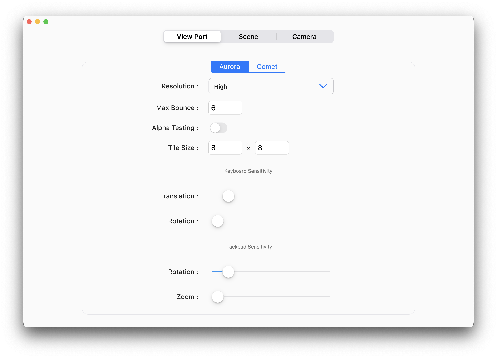
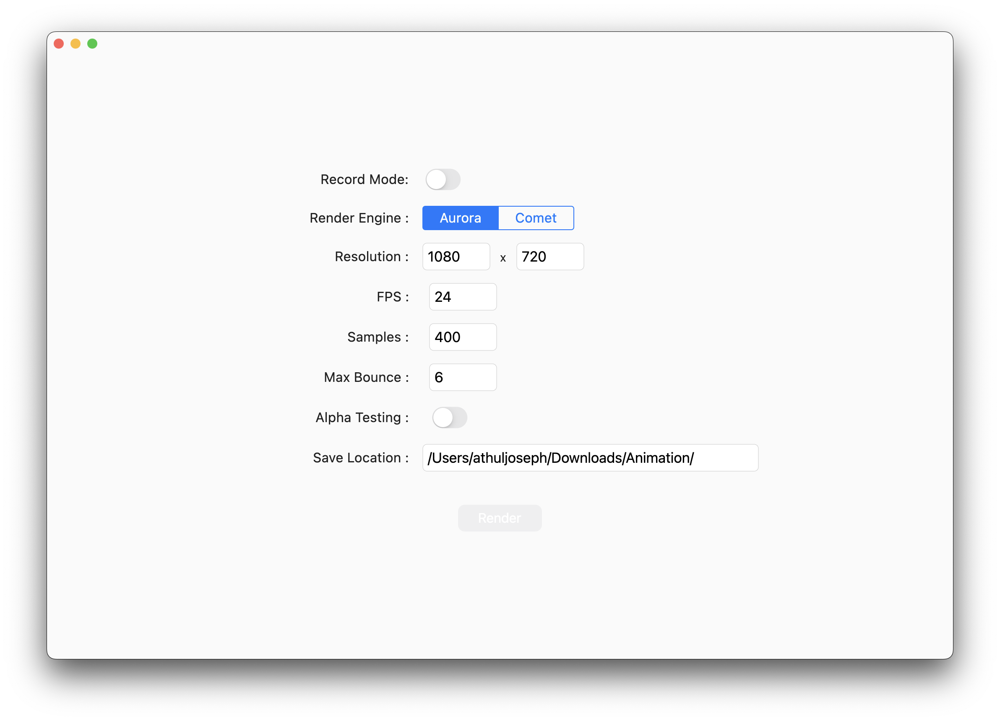
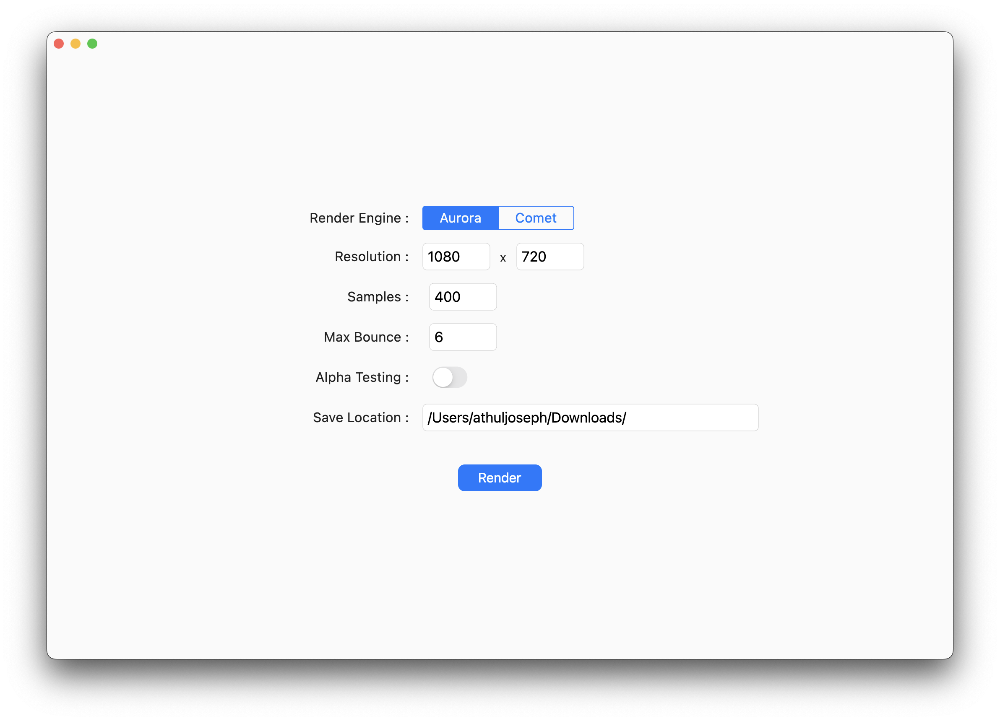
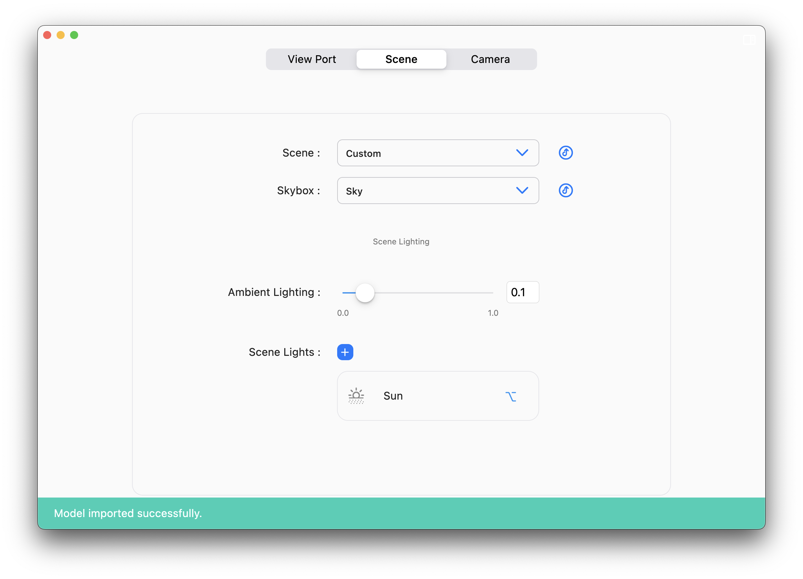

# Blue Engine

Rendering Engine implemented in Swift programming language and utilizing Metal framework.

Consists of two engines:  
    - Aurora (Ray Tracing Engine)  
    - Comet (Rasterization Engine)

## Preview Images

## Render Images

## Version History

* blue4.5
  * The engine can now render animations
  * Added Alpha Testing
  * Added Fresnel Effect
  
* blue4.4
  * Added support to import 3D models and sky-boxes.
  * Option to add light to custom scene.
  
* blue4.3
    * Integrated Flutter for the development of a comprehensive UI
    * Fixed issue with texture tile rendering
    * Added ambient lighting support to Aurora Engine.
