# Blue Engine

Rendering Engine implemented in Swift programming language and utilizing Metal framework.

Consists of two engines:  
    - Aurora (Ray Tracing Engine)  
    - Comet (Rasterization Engine)

## App Preview

  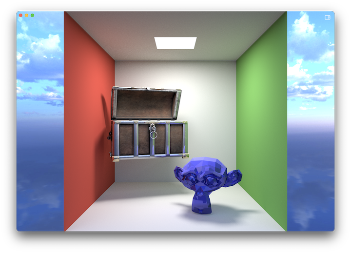
  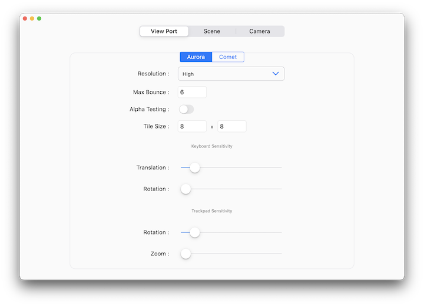
  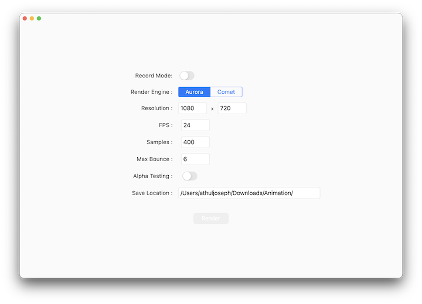
  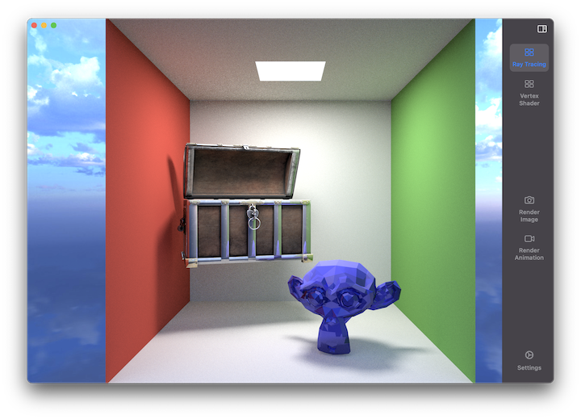
  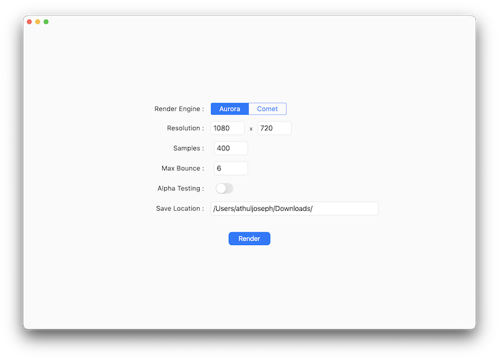
  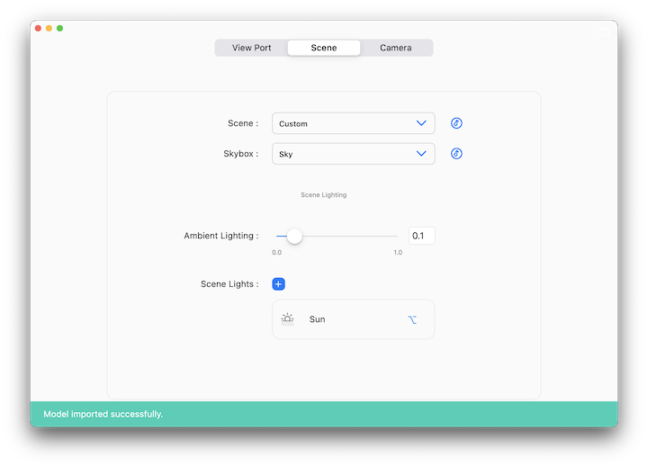

## Renders

  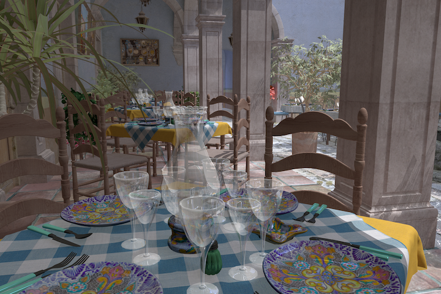
  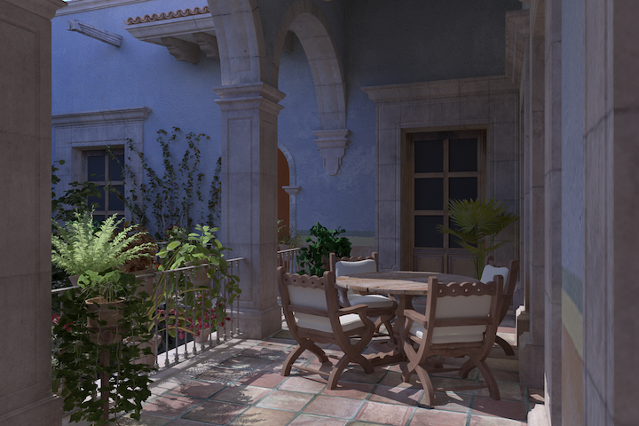
  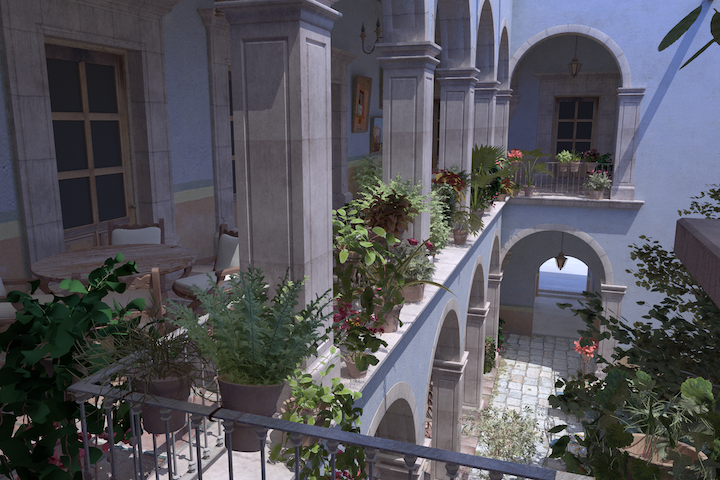
  
  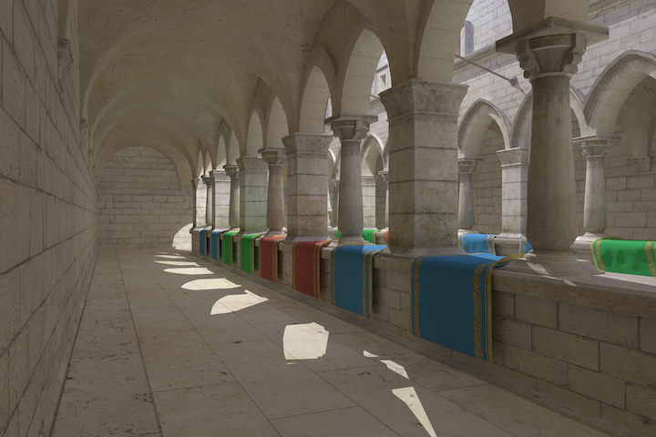
  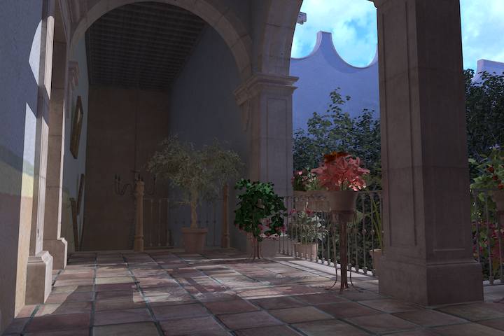
  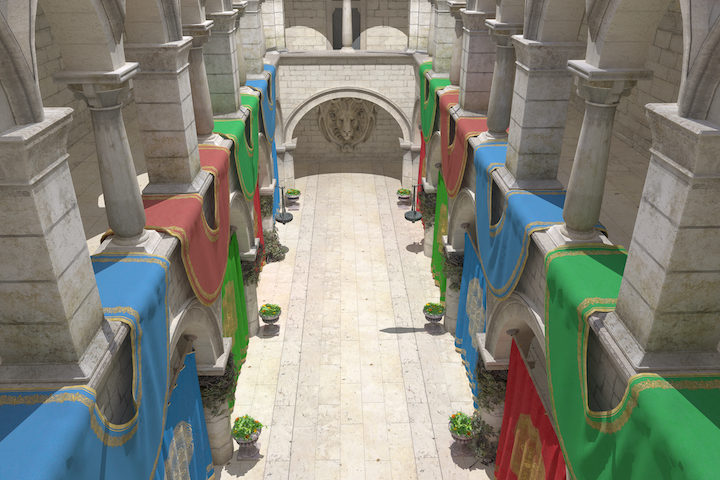
  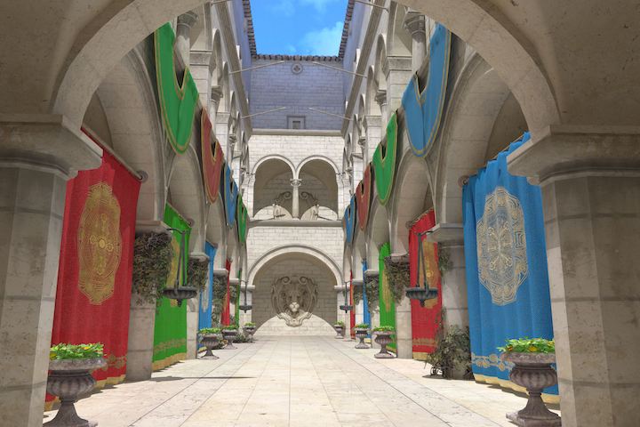
  
  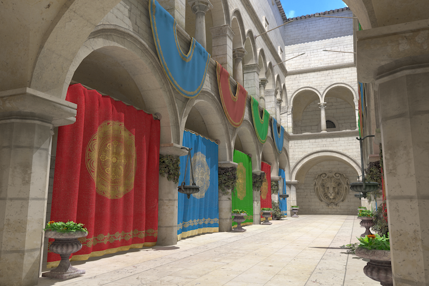
  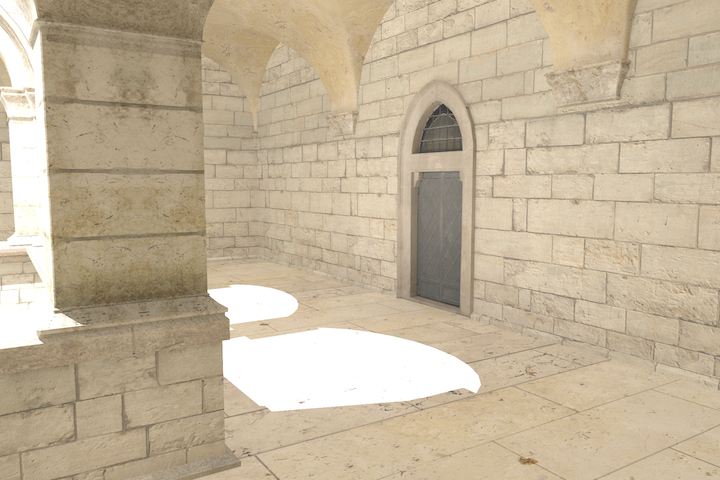
  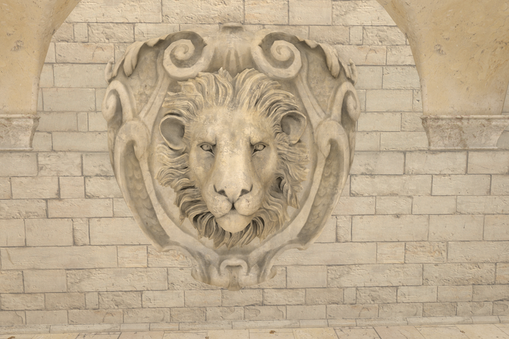
  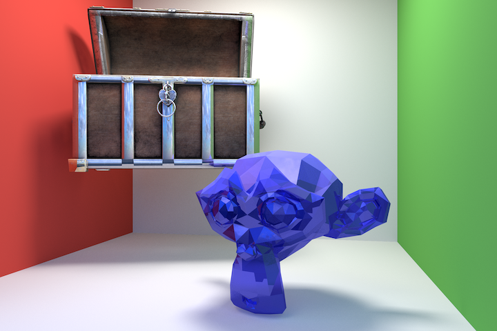
  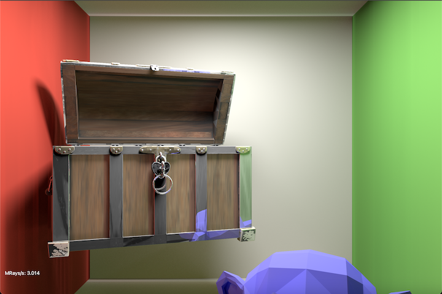
  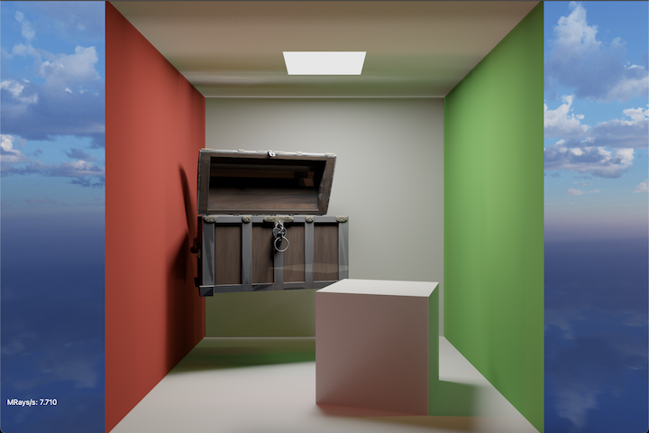
  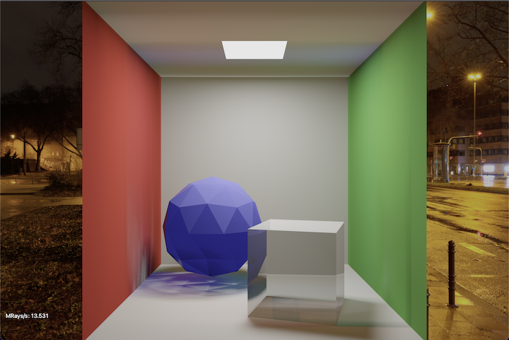
  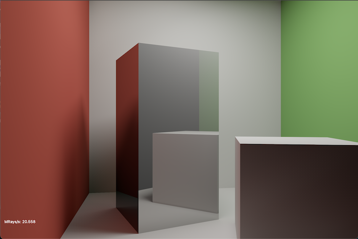
  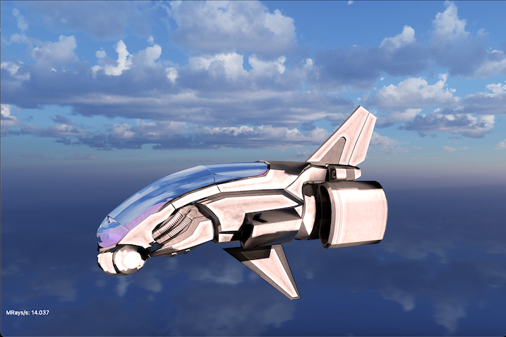

## Version History

* blue4.7
  * Added Dynamic Ray Tracer.
  * Can render Dynamic Scenes as animation.
  * Massive perfomance improvement in Dynamic Scene.
  * Added support for emissive object.
  
* blue4.6
  * Can control camera from the UI now, allowing more precise control over the camera (helpful for rendering).
  * Added option to control render quality in view port, making the app usable with larger and complex OBJ files.
  
* blue4.5
  * The engine can now render animations.
  * Added Alpha Testing.
  * Added Fresnel Effect.
  
* blue4.4
  * Added support to import 3D models and sky-boxes.
  * Option to add light to custom scene.
  
* blue4.3
    * Integrated Flutter for the development of a comprehensive UI.
    * Fixed issue with texture tile rendering.
    * Added ambient lighting support to Aurora Engine.
